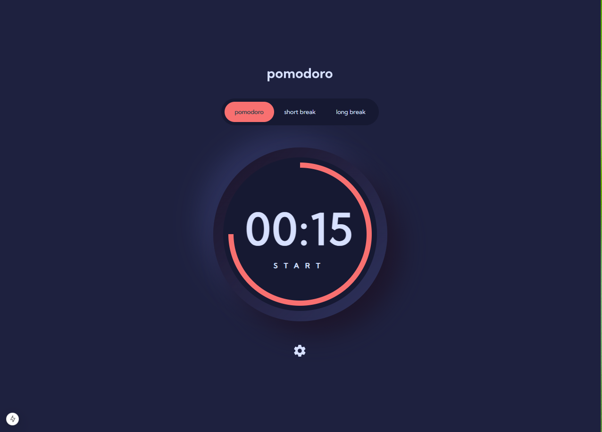

# Frontend Mentor - Pomodoro app solution

This is a solution to the [Pomodoro app challenge on Frontend Mentor](https://www.frontendmentor.io/challenges/pomodoro-app-KBFnycJ6G). Frontend Mentor challenges help you improve your coding skills by building realistic projects. 

## Table of contents

- [Overview](#overview)
  - [The challenge](#the-challenge)
  - [Screenshot](#screenshot)
  - [Links](#links)
- [My process](#my-process)
  - [Built with](#built-with)
  - [What I learned](#what-i-learned)
  - [Useful resources](#useful-resources)
- [Author](#author)

**Note: Delete this note and update the table of contents based on what sections you keep.**

## Overview

### The challenge

Users should be able to:

- Set a pomodoro timer and short & long break timers
- Customize how long each timer runs for
- See a circular progress bar that updates every minute and represents how far through their timer they are
- Customize the appearance of the app with the ability to set preferences for colors and fonts

### Screenshot

### Links

- Solution URL: [Pomodoro challenge](https://www.frontendmentor.io/challenges/pomodoro-app-KBFnycJ6G)

## My process

### Built with

- Mobile-first workflow
- [Tailwind-Css](https://tailwindcss.com/docs/installation) - This helped me for use css.
- [React](https://reactjs.org/) - JS library
- [Next.js](https://nextjs.org/) - React framework

### What I learned

I learned how to use hooks like useState, useEffect, and useCallback. I also learned to intelligently split my code into components and constantly refactored the logic. I also learned the spirit of React, understanding when things re-render.

### Useful resources

- [BeginReact](https://codelynx.dev/beginreact) - This helped me for use React Hooks.
- [https://nextjs.org/docs](https://www.example.com) - This is an amazing technologie helped me to install speedly a React project. I'd recommend it to anyone still learning this.

## Author

- Website - [@IF-WEB-DEV](https://www.if-web-dev.com)
- Frontend Mentor - [@if-web-dev](https://www.frontendmentor.io/profile/yourusername)
- Twitter - [@yourusername](https://www.twitter.com/yourusername)
